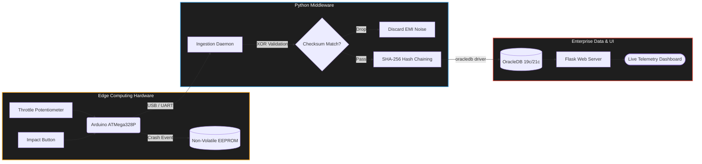

# Vehicle EDR (Event Data Recorder) System

## The Problem
Modern vehicle black boxes (EDRs) are proprietary, closed-loop systems. During high-impact collisions, abrupt power loss can corrupt the exact millisecond of telemetry needed for fault determination. Furthermore, stored data is highly vulnerable to post-crash manipulation.

## The Proposed Architecture
This repository outlines an open EDR prototype that solves these vulnerabilities:

**Hardware Survival**-Event data is written directly to non-volatile EEPROM before serial transmission, surviving instantaneous power loss.

**Data Integrity**-Every serial packet carries an XOR checksum computed at the hardware level.

**Cryptographic Custody**-Every OracleDB row is cryptographically chained via SHA-256 hashing. Any manual database edit breaks the chain.

## What This Is: 

A tamper-evident, crash-survivable vehicle event data recorder architecture. Built for edge-computing automotive telemetry with production-grade data integrity using C++, Python, and OracleDB.

This project outlines an open EDR prototype architecture that solves these vulnerabilities using three core engineering principles:

**EEPROM Crash Logging:** Event data is written directly to the microcontroller's non-volatile silicon *before* serial transmission. Data survives instantaneous power loss during an impact.

**XOR Packet Checksums:** Every serial packet carries a checksum computed at the hardware level. Corrupted bytes from electromagnetic interference (EMI) are silently dropped before reaching the middleware.

**SHA-256 Hash Chain:** Every OracleDB row is cryptographically chained to the previous row via SHA-256 hashing. Any manual or malicious database edit breaks the chain, making tampering mathematically obvious and detectable instantly

## Phase 1 Proof-of-Concept

**System Architecture**



```
[Simulated Sensors] ──┐
[Potentiometer]     ──┤── Edge MCU ──UART──▶ Python Middleware ──▶ OracleDB
[Push Button]       ──┘   + EEPROM    9600     XOR checksum        SHA-256
                                                    │             hash chain
                                                    ▼
                                             Flask Dashboard
                                     (live RPM · events · tamper alerts)
```
## Project Structure

```vehicle-edr-system/
├── firmware/
│   ├── edr_core/
│   │   └── edr_core.ino             # Edge logic-sensor ingestion + checksums
│   └── edr_recovery/
│       └── edr_recovery.ino         # Utility sketch to dump EEPROM after power loss
├── database/
│   └── init_schema.sql              # OracleDB schema (Identity Columns, Indexes)
├── middleware/
│   ├── config.py                    # OracleDB connection strings
│   ├── db_handler.py                # oracledb driver helper + SHA-256 hash logic
│   ├── serial_ingest.py             # UART listener + XOR checksum validator
│   └── analyzer.py                  # Cryptographic chain verification script
├── dashboard/
│   ├── app.py                       # Flask web server for telemetry dashboard
│   ├── static/                      # CSS/JS assets
│   └── templates/
│       └── index.html               # UI layout for data visualization
└── docs/
    └── architecture.md              # Extended system design notes
```
## Hardware Required
| Component | Cost |
|---|---|
| Arduino Uno (CH340 clone) | Rs.478 |
| 10kΩ Potentiometer | Rs.22 |
| LM35 Temperature Sensor | Rs.72 |
| Tactile Push Button | Rs.14 |
| Breadboard + Jumper Wires | Rs.222 |
| USB-A to USB-B cable | Available |
| **Total** | **Rs.810** |


## Tech Stack & Environment

**Edge Compute:** C++ / Arduino Framework

**Middleware:** Python 3 (`pyserial`, `hashlib`, `oracledb`)

**Database:** Oracle Database 21c

**OS:** Fedora Linux

## Domain
**Open Innovation** - embedded systems, real-time
sensor acquisition, hardware-software integration.


## License

MIT License - see [LICENSE](LICENSE)
